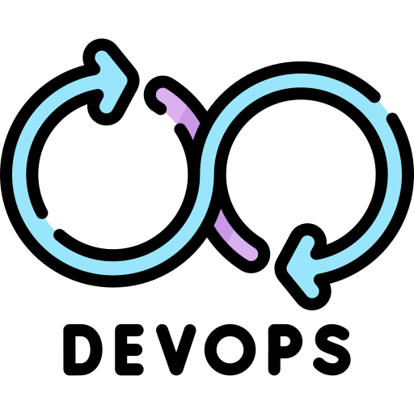

<h1>

<a href="https://github.com/GnomeShift/lan_devops" target="_blank" rel="noopener noreferrer">lan_devops</a>

</h1>

<a href="README.md">🇷🇺 Русский</a>

## 🚀Быстрая навигация
* [Обзор](#обзор)
* [Установка](#установка)

# 🌐Обзор
**lan_devops** - это лендинг с информацией про различные инструменты DevOps.

# [⬇️Установка](INSTALL.md)